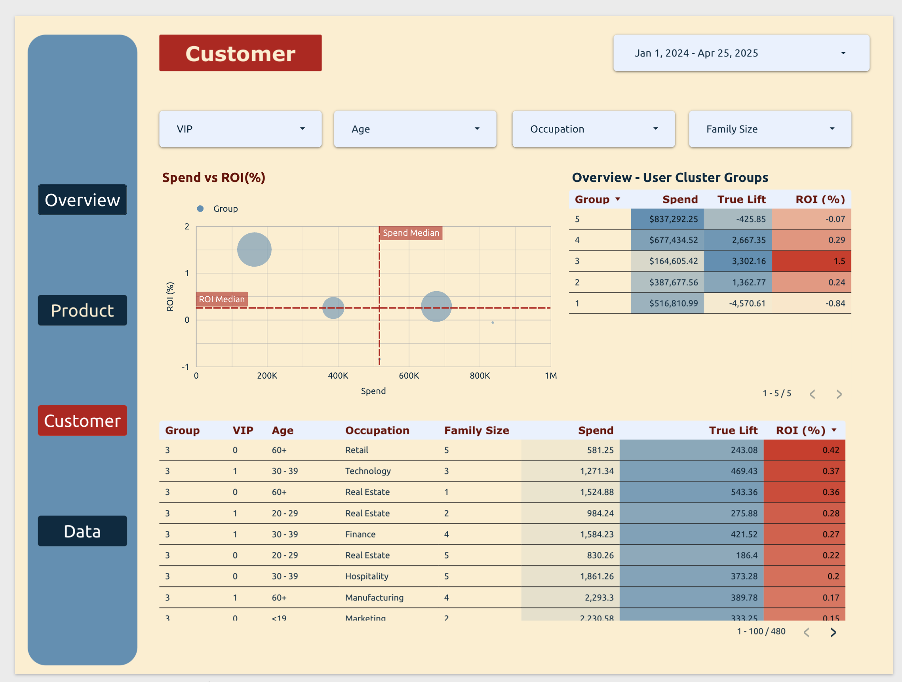

# retail_dashboard

This repository contains all codes used in [Retail Marketing Dashboard](https://lookerstudio.google.com/reporting/a40dd076-71bd-46f9-a9db-fcfa1c1f9d7b) deployed in Google Looker Studio, which are

  - Generate simulated data by Python Faker in Jupyter Notebook
  - Design layered data warehouse to simulate ETL pipeline by SQL in BigQuery
  - Deploy pipeline of writing tables using google.cloud.bigquery in BigQuery Jupyter Notebook
  
## Dashboard Demo
 
